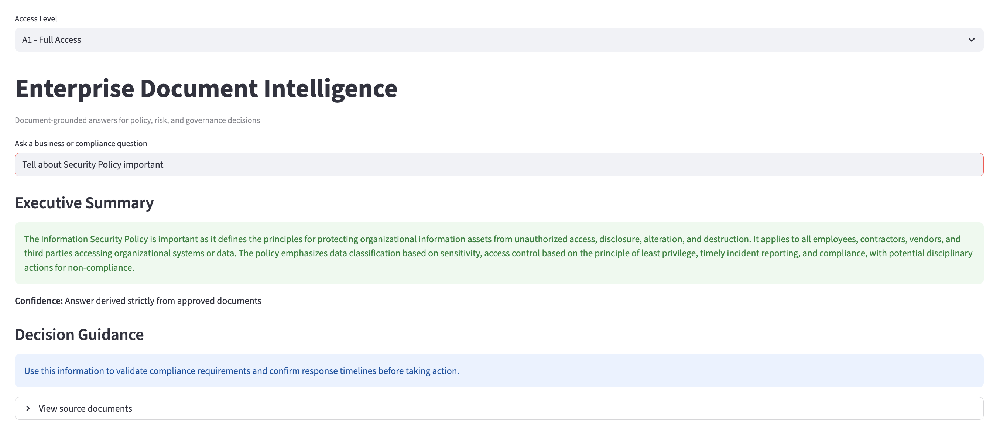
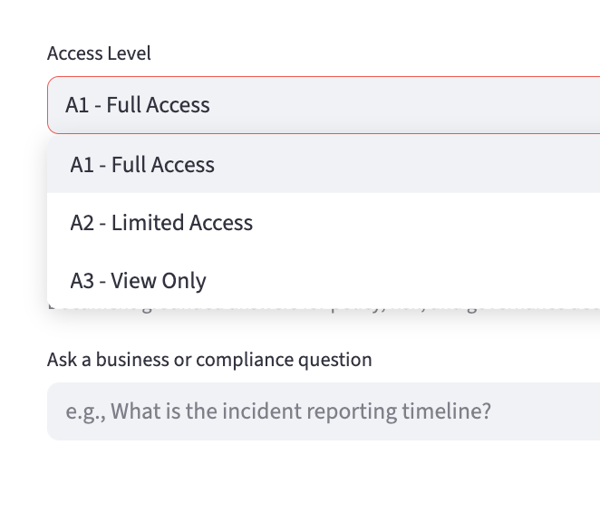

# Enterprise Document Intelligence (RAG-based AI System)
### by Rajkumar Mouttou - https://www.linkedin.com/in/rajkumar-mouttou/

## Overview
Enterprise Document Intelligence is a **governance-safe, retrieval-augmented AI system** that provides accurate, document-grounded answers from enterprise policies, risk, and compliance documents.

Unlike generic chatbots, this system is designed for **regulated environments**, ensuring traceability, least-privilege access, and controlled escalation for unknown queries.

## Demo Screenshots

### Executive Summary View


### Role-Based Access Control

---

## Key Capabilities
- Document-grounded Q&A using Retrieval-Augmented Generation (RAG)
- Supports PDF, DOCX, and TXT documents
- Prevents hallucinations with strict prompt constraints
- Role-based access control (A1 / A2 / A3)
- Executive-ready Streamlit UI
- Source traceability without information leakage
- Provider-agnostic LLM design (OpenAI / Ollama)

---

## Architecture (High Level)
1. Document ingestion and intelligent chunking  
2. Vector embeddings stored in FAISS  
3. Semantic retrieval using MMR strategy  
4. LLM-based answer generation with governance prompts  
5. UI-level role-based visibility controls  

**Design principle:** Clear separation of ingestion, retrieval, reasoning, and presentation layers.

---

## Technology Stack
- Python 3.9+
- LangChain – RAG orchestration
- FAISS – Vector store
- OpenAI / Ollama – LLM and embeddings (config-driven)
- Streamlit – Executive UI
- Virtualenv – Environment isolation

---

## Project Structure
```
enterprise_doc_ai/
├── app.py                  # CLI-based Q&A (optional)
├── ui_streamlit.py         # Streamlit executive UI
├── README.md
├── vectorstore/            # FAISS index
│
├── config/
│   └── llm_config.py
│
├── ingestion/
│   ├── loaders.py
│   ├── splitter.py
│   └── embed_store.py
│
├── retrieval/
│   └── retriever.py
│
├── qa/
│   └── rag_chain.py
│
└── data/
    └── raw_docs/           # Input documents
```

---

## Role-Based Access Levels
| Level | Intended Role | Visibility |
|------|--------------|------------|
| A1 | Executive / Audit | Full answer + sources |
| A2 | Manager / Reviewer | Full answer + limited evidence |
| A3 | General User | Summary only + source names |

This follows **least-privilege and information-minimization principles**.

---

## Governance & Safety Controls
- Answers generated **only from retrieved documents**
- Unknown queries escalate to:
  > “Please contact the administrator or compliance team”
- Source content hidden by default in UI
- No hallucinated responses
- Separation of reasoning and presentation logic

---

## Setup Instructions

### 1. Create Virtual Environment
```bash
python3 -m venv .venv
source .venv/bin/activate
```

### 2. Install Dependencies
```bash
pip install langchain langchain-community langchain-openai faiss-cpu pypdf docx2txt streamlit
```

### 3. Configure OpenAI (optional)
```bash
export OPENAI_API_KEY="your_api_key"
```

(Or switch to Ollama in `config/llm_config.py`)

---

## Run the Application

### Streamlit UI (Recommended)
```bash
streamlit run ui_streamlit.py
```

### CLI Mode (Optional)
```bash
python app.py
```

---

## Sample Questions
- What is the incident reporting timeline?
- What are the access control principles?
- What are the project closure requirements?

---

## Interview-Ready Summary
This project demonstrates how **GenAI can be safely applied in governance-heavy environments** by combining retrieval, strict prompting, role-based access, and executive-focused design—turning AI from a risk into a decision-support capability.

---

## Future Enhancements
- SSO-based RBAC integration
- Audit logging
- Document lifecycle management
- Cloud vector database support
- Policy-driven access rules (ABAC)
